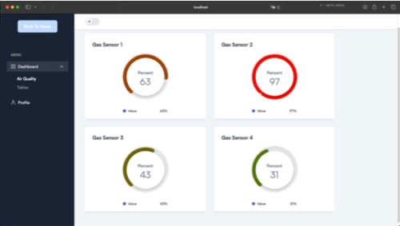
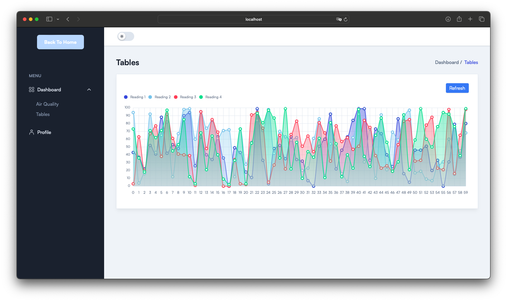

# Gas Sensor Dashboard

## Demo

You can view the live demo of the Gas Sensor Dashboard [here](https://kayukbb.github.io/gas-sensor-dashborad-react/).

## Description

This project is a web application built using **React** and **Vite** for the frontend, along with **Node.js** and **Express.js** for the backend. The purpose of this dashboard is to visualize data from gas sensors.

**Note:** Currently, the Node.js server is not available, so no data will be displayed on the dashboard.

## Features

- Responsive design that works on various devices.
- User-friendly interface to visualize gas sensor data.
- Profile section to learn more about the developer.

- ### Example Screenshots

Here are some screenshots of the demo when running the Node.js server:

#### Screenshot 1: Dashboard of Gas Sensors
 <!-- Replace with the path to your actual screenshot -->

#### Screenshot 2: Table View
 <!-- Replace with the path to your actual screenshot -->


## Installation

To run this project locally, you will need to clone the repository and install the necessary dependencies.

```bash
# Clone the repository
git clone https://github.com/yourusername/gas-sensor-dashborad-react.git

# Navigate to the project directory
cd gas-sensor-dashborad-react

# Install dependencies
npm install

# Run the application
npm run dev
```

## Node.js Server

To run the application with the Node.js server, use the following command:

```bash
cd to nodeserver
npm i
node server.js
